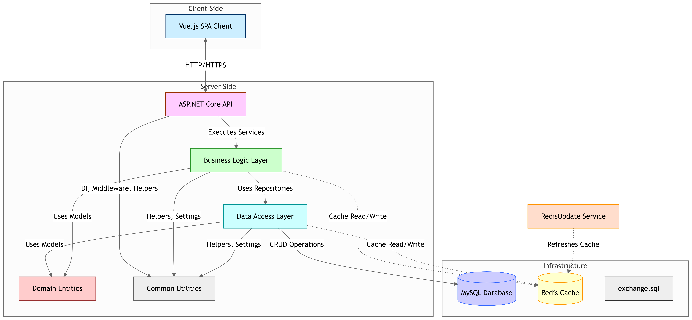

# Exchange 

## Diagram 

## Project Info 

1. N-Tier Architecture
2. C# ASP.NET Core 3.1 RESTFul API (Jwt, Swagger, WebSockets)
3. MySQL DB for data storage (EntityFrameworkCore)
4. Redis for data caching
5. Console app for Redis Update using background thread in it to do Redis data updating frequencly (250 msec).
6. Vue.js 2 for front end

## License

Licensed under the [MIT license](LICENSE.md).
